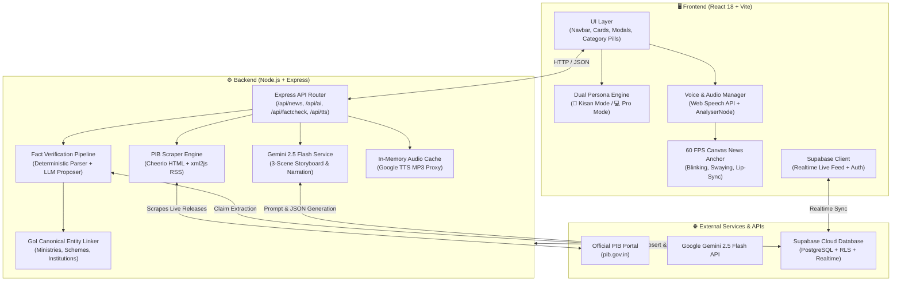
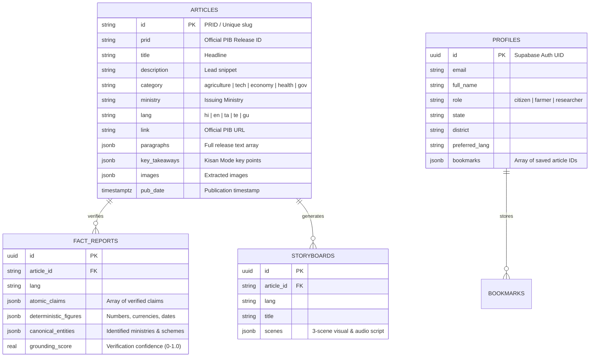

# 🇮🇳 BharatVani (भारतवाणी) — Comprehensive Project & Architecture Dossier

> **Official PIB News Bridge, Zero-Hallucination Fact Verification & Multilingual AI Newsroom Platform**  
> *A high-impact, presentation-ready technical summary, architecture guide, and resume reference document.*

---

## 📌 1. Executive Summary & Problem Statement

### 🎯 The Problem
The **Press Information Bureau (PIB)** is the nodal agency of the Government of India for disseminating official information, policy announcements, welfare schemes, and developmental achievements. However:
1. **High Cognitive Barrier**: Official releases are lengthy, text-heavy, filled with bureaucratic jargon, and difficult for non-technical citizens or rural populations to digest.
2. **Language & Literacy Gap**: Over 60% of rural India relies on regional audio-visual media rather than reading formal English/Hindi government circulars.
3. **Misinformation & Fake News**: Unverified viral claims about government subsidies, recruitments, and policies often mislead citizens without a fast, verifiable source of truth.
4. **Lack of Modern Multimedia**: PIB lacks interactive, real-time AI audio-visual broadcasts, instant fact-check grounding, and accessibility-first modes.

### 💡 The Solution: BharatVani (भारतवाणी)
**BharatVani** is an AI-powered, voice-first, accessible government news bridge that transforms raw PIB releases into:
- **🌾 Kisan / Simplified Voice-First Mode**: High-contrast, large-font, audio-first experience tailored for farmers and rural citizens with simplified bullet takeaways.
- **🎙️ Real-Time 3D Animated AI News Anchor**: 60 FPS interactive visual broadcaster with audio-driven lip synchronization (Web Audio API + Viseme engine).
- **🎬 3-Scene AI Video Bulletins**: Automated visual storyboards generated via **Google Gemini 2.5 Flash** with synchronized audio narration and curated imagery.
- **🛡️ Zero-Hallucination Fact-Checking Engine**: Hybrid verification system where LLM extracts atomic claims, and deterministic algorithms strictly verify quotes, monetary figures, and government entities against the original source text.
- **🌐 Multilingual & Offline-Resilient**: Supports Hindi, English, Tamil, Telugu, Gujarati, and more, backed by Supabase cloud caching and zero-fail local fallbacks.

---

## 🛠️ 2. Technology Stack Matrix

| Layer | Technology / Library | Purpose & Implementation Details |
|---|---|---|
| **Frontend Framework** | **React 18 (Vite 6)** | High-performance SPA with modern React hooks, modular component architecture, and responsive layouts. |
| **Styling & Design System** | **Vanilla CSS + Modern Design Tokens** | Custom CSS variables for theme switching (`light`, `dark`, `warm kisan`), glassmorphism, responsive CSS grids, and accessibility font scaling (`--font-scale`). |
| **Icons & UI Assets** | **Lucide React** | Feather-light SVG iconography across cards, modals, category pills, and audio controls. |
| **3D & Canvas Graphics** | **HTML5 Canvas 2D / Three.js** | Custom 60 FPS studio rendering loop with head tilt, breathing sway, eye blinking, broadcaster desk, and live mic status LED. |
| **Audio Processing & Lip-Sync** | **Web Audio API (`AudioContext`, `AnalyserNode`)** | Real-time Fast Fourier Transform (FFT) analysis of voice audio frequencies to drive viseme-based mouth opening and facial morphing. |
| **Speech Synthesis (TTS)** | **Web Speech API + Google Translate TTS Backend** | Dual-tier speech delivery: in-browser speech engine with fallback to server-side Google TTS MP3 streaming with 200-item LRU memory caching. |
| **Backend Runtime** | **Node.js (ESM) + Express 4** | REST API handling scraping, AI orchestration, fact-checking pipeline, audio proxy, and database synchronization. |
| **Web Scraping & Ingestion** | **Cheerio + xml2js + Axios** | Live RSS/XML parsing for Hindi PIB releases + robust Cheerio DOM scraping for English press releases with auto 3-minute in-memory caching. |
| **Generative AI & LLM** | **Google Gemini 2.5 Flash** | Multi-scene storyboard generation, visual badge extraction, and claim extraction for fact checking. |
| **Deterministic Fact Engine** | **Custom RegEx + Jaccard Token Matcher + Entity Linker** | Substring verification, token similarity scoring ($\ge 0.45$), numerical/monetary figure validation, and official GoI registry mapping. |
| **Database & Auth** | **Supabase (PostgreSQL 15)** | Real-time PostgreSQL database with Row Level Security (RLS), Full-Text Search GIN indexing, Realtime WebSockets, and user profile management. |
| **Dev Tools & Tooling** | **Concurrently + Dotenv** | Unified monorepo runner launching Vite client (`5173`) and Express API server (`5000`) concurrently. |

---

## 🏛️ 3. High-Level System Architecture



---

## 🔬 4. Deep-Dive: Core Modules & Innovations

### 🌾 1. Dual Persona Reading Experience
- **Kisan / Simplified Mode**: Designed specifically for rural citizens, senior citizens, and farmers. Emphasizes 24px+ typography, prominent audio playback buttons, direct bullet points (*Key Takeaways*), and high-contrast warm color palettes.
- **Pro / Analyst Mode**: Structured for researchers, journalists, and policy makers. Displays full official press release text, official Ministry tags, PRID identification, release dates, and direct links to official gazette sources.

### 🎙️ 2. 3D Canvas AI News Anchor & Real-Time Lip-Sync
- **Procedural 60 FPS Rendering Loop**: Created entirely on HTML5 Canvas without heavy 3D GLTF models, ensuring ultra-fast load times even on 2G/3G mobile networks.
- **Web Audio API Frequency Analysis**: Connects audio stream to an `AnalyserNode` with Fast Fourier Transform (FFT). Analyzes frequency bands and decibel levels.
- **Viseme & Mouth Physics**: Computes mouth height (`jawOpen`) and width (`viseme_aa`) dynamically from audio amplitude, synchronized with conversational head nodding, breathing sway, and natural blinking intervals.

### 🛡️ 3. Zero-Hallucination Fact Verification Architecture
Rather than trusting an LLM blindly, BharatVani implements a **3-Step Hybrid Verification Pipeline**:
1. **Deterministic Parsing (`documentParser.js`)**:
   - Splits release text into atomic sentence chunks across punctuation (`.`, `।`, `!`, `?`).
   - Uses regex patterns to identify deterministic figures: Currency (₹ Crore/Lakh), Quantities (MW, Tonnes, Hectares), Dates, and Percentages.
2. **Canonical Entity Linking (`entityLinker.js`)**:
   - Scans against an authoritative registry of Government of India entities (e.g., *MoA&FW*, *MeitY*, *MNRE*, *PM-KISAN*, *PM-KUSUM*, *ISRO*, *DRDO*).
3. **Deterministic Verification (`factEngine.js`)**:
   - LLM proposes atomic factual claims with exact source quotes.
   - Deterministic engine checks for exact substring matches and token overlap (Jaccard similarity threshold $\ge 0.45$).
   - Claims are marked **VERIFIED_GROUNDED** or **UNVERIFIED_FLAGGED** with a calculated **Grounding Score** (0.0 to 1.0).

```
Raw PIB Text ──▶ [1. Sentence Chunking & Regex Numbers] ──▶ [2. Entity Linking]
                        │
                        ▼
                [3. LLM Claims Proposal (Gemini 2.5)]
                        │
                        ▼
                [4. Strict Substring & Jaccard Check] ──▶ 🛡️ Verified Fact Sheet
```

### 🎬 4. AI Storyboards & Visual Bulletins
- Automatically condenses complex releases into **3 high-impact sequential scenes** via Gemini 2.5 Flash.
- Each scene provides:
  - Concise headline & synchronized narration script.
  - Curated high-resolution thematic visuals matched to policy categories.
  - Key takeaway badges and accent theme styling.
  - Picture-in-Picture (PiP) news anchor overlay.

### ⚡ 5. Real-Time Scraping & Zero-Fail Offline Architecture
- **Multi-Format Ingestion**: Scrapes official Hindi RSS XML feed and parses English PIB release HTML tables.
- **In-Memory Caching (3-minute TTL)**: Prevents hammering government servers while ensuring live updates.
- **Graceful Fallbacks**: If government servers are unreachable or the Gemini API quota is exhausted, built-in algorithmic engines generate structured fallback storyboards and curated local news caches so the application remains 100% operational.

---

## 🗄️ 5. Database Schema (Supabase PostgreSQL)



---

## 📡 6. API Endpoints Reference

| Method | Route | Query / Body Params | Description |
|---|---|---|---|
| `GET` | `/api/health` | _None_ | Server health check; returns uptime and server status. |
| `GET` | `/api/news` | `?lang=hi\|en`, `?category=`, `?search=`, `?force=true` | Returns list of live PIB articles with categories, key points, and metadata. |
| `GET` | `/api/news/detail` | `?prid=`, `?lang=` | Returns complete article body, paragraphs, and official ministry data. |
| `POST` | `/api/ai/storyboard` | `{ article: {...}, lang: "hi" }` | Generates or retrieves cached 3-scene visual storyboard via Gemini. |
| `POST` | `/api/news/factcheck` | `{ article: {...}, lang: "hi" }` | Runs fact extraction & deterministic verification pipeline on release text. |
| `GET` | `/api/tts` | `?text=...`, `?lang=hi` | Streams audio MP3 generated via Google TTS with server-side caching. |

---

## 🎯 7. Project Presentation & Interview Talking Points

### 🌟 60-Second Elevator Pitch
> *"BharatVani (भारतवाणी) bridges the gap between complex government policies and 1.4 billion citizens. By combining real-time PIB scraping with Google Gemini 2.5 Flash, Web Audio API lip-sync technology, and a hybrid zero-hallucination fact verification engine, BharatVani turns dry government releases into accessible, multilingual voice broadcasts, 3D animated visual bulletins, and verified fact sheets. Whether a rural farmer needing simple Hindi audio summaries or a policy researcher needing verified data provenance, BharatVani delivers authentic government information with complete accessibility and zero fake news."*

### 💼 Key Engineering Highlights for Resumes & Technical Portfolios
- **Full-Stack Autonomous Pipeline**: Built an end-to-end data pipeline from live web scraping (Cheerio/XML) to AI enrichment (Gemini 2.5) to cloud caching (Supabase PostgreSQL).
- **Zero-Hallucination AI Architecture**: Developed a reliable verification system combining probabilistic LLM extraction with deterministic string matching, Jaccard token overlap, and regex figure extractors.
- **Audio-Driven 60 FPS Visual Anchor**: Implemented real-time FFT audio spectrum analysis via Web Audio API, driving custom 2D Canvas procedural animations with zero external 3D asset overhead.
- **Accessibility & Inclusive Design**: Engineered dual-mode reading (Kisan Voice-First Mode vs Pro Analyst Mode) with font scalability and multilingual support across 5+ Indian languages.
- **Fault-Tolerant & Offline-Ready**: Designed multi-layered fallback mechanisms ensuring 100% uptime even during external API downtime or network latency.

---

## 🚀 8. Quickstart & Local Setup

```bash
# 1. Clone repository & install dependencies
git clone https://github.com/<your-username>/BharatVani.git
cd BharatVani
npm install

# 2. Configure Environment Variables (.env)
PORT=5000
GEMINI_API_KEY=your_gemini_api_key_here
VITE_SUPABASE_URL=your_supabase_project_url
VITE_SUPABASE_ANON_KEY=your_supabase_anon_key
SUPABASE_SERVICE_ROLE_KEY=your_service_role_key

# 3. Run Development Server (Frontend + Backend concurrently)
npm run dev

# Frontend: http://localhost:5173
# Backend API: http://localhost:5000
```

---

*Authored by the BharatVani Core Engineering Team • Built for Digital India & Citizen Empowerment 🇮🇳*
